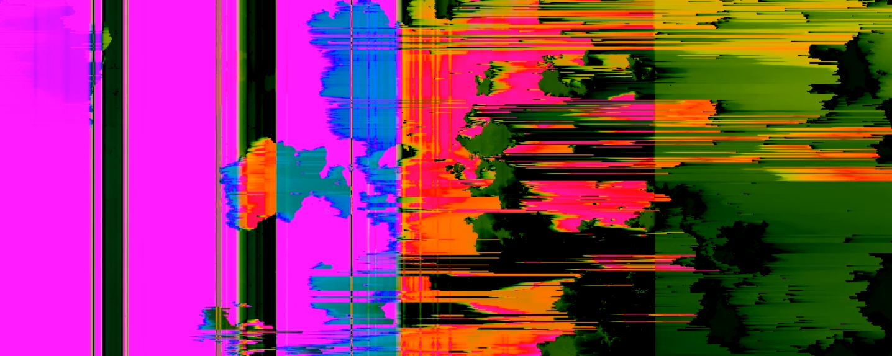
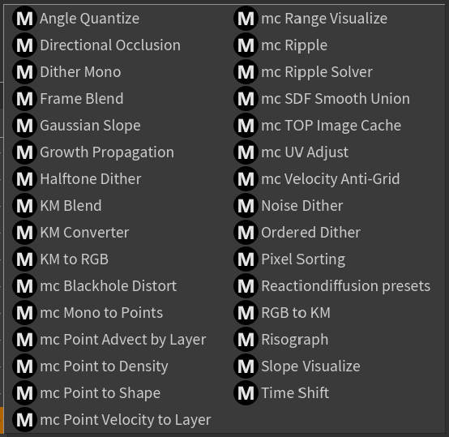

# MotionCOPs

A growing toolkit of Copernicus nodes for Houdini 21, built from my daily work.

Every tool here is one I actually use — tested on real projects at 10K+ resolution and refined through day-to-day use. Not a tech demo: it's the kit I reach for every day.

**Inside:** organic growth · stylization · dithering & risograph · glitch · Kubelka-Munk color · SOP ↔ image bridges · time & caching utilities

> Supports Houdini 21. Jump to [Installation](#installation).

---

## Showcase

### Swirl

### Growth Propagation

Generate organic spreading patterns — cellular growth, lightning, cracks, veins, and DLA-style structures. Supports directional fields and attractors for precise control. Inspired by Nick Taylor's Aelib, reimagined for COPs.

  

### Ripple

GPU-based ripple simulation for water surfaces, shockwaves, and reactive wave patterns — driven by `mc Ripple Solver` directly inside the Copernicus network.

### Analysis

Slope, occlusion, and SDF tools treat images as fields rather than pixels — useful for terrain-style studies, directional lighting, and fractal growth structures.

  

### Pixel Sorting

GPU-accelerated pixel sorting for glitch art, flowing textures, and stylized transitions. Mask by luminance or custom input, with built-in growth animation.

### Risograph

Instant risograph print aesthetic built on Kubelka-Munk color theory — real ink mixing, not RGB filters. Three modes: organic, halftone, or digital.

  

---

## Tool Catalog

### Simulation & Growth
Growth Propagation · Reactiondiffusion Presets · Copernicus Solver *(SOP)*

### Dithering & Stylization
Risograph · Halftone Dither · Ordered Dither · Noise Dither · Dither Mono · Pixel Sorting

### Analysis & SDF
Gaussian Slope · Slope Visualize · Angle Quantize · Directional Occlusion · mc SDF Smooth Union

### Image Distortion & FX
mc Blackhole Distort · mc Ripple · mc Ripple Solver · mc Velocity Anti-Grid

### Point ↔ Layer Bridge
mc Mono to Points · mc Point to Density · mc Point to Shape · mc Point Velocity to Layer · mc Point Advect by Layer

### Time & Caching
Time Shift · Frame Blend · Cache · mc TOP Image Cache

### Utility
mc UV Adjust · mc Range Visualize · mc Flow Block Begin / End

### Kubelka-Munk Color Science
RGB to KM · KM to RGB · KM Converter · KM Blend

---

## Installation

1. Download and extract the repository to any location
2. In your Houdini home directory (e.g. `C:/Users/MY_USER/Documents/houdini21.0`), create a `packages` folder if it doesn't exist
3. Copy `MotionCOPs.json` into `packages/`
4. Edit the JSON file — set the path to your MotionCOPs directory

See the [Houdini docs](https://www.sidefx.com/docs/houdini/ref/plugins.html) for more on package files.
